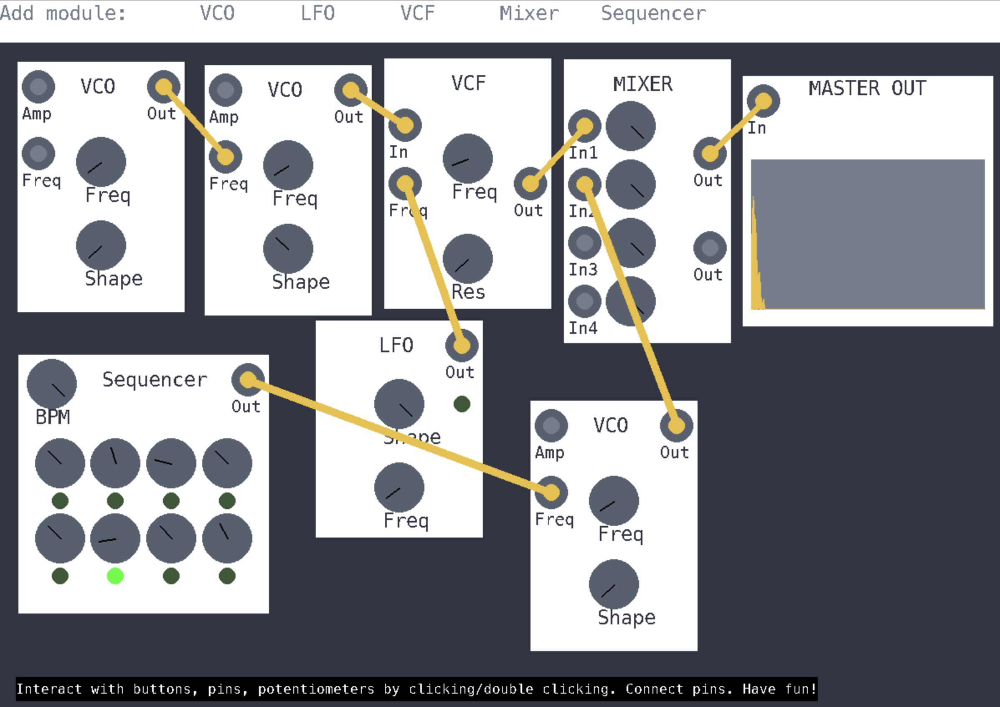

# Software Modular Synthesizer

This project was created as a part of the *Computer Sound Production* course at the *Faculty of Computer and Information Science, University of Ljubljana*.

## Description
This project simulates an analog modular synthesizer system. Even with only some basic components implemented here we can make some interesting sounds, with just a bit of creativity.

The project was developed in Python with the use of Pyo for sound processing and PyGame for visuals.

You can read more about the project in the report located in `reports/final_report.pdf`.

## Project structure
- `src/` contains all source code of the project
- `reports/` contains the reports
- `media/` contains images and videos

## Installation and running
0. The project was developed with Python 3.9. I advise the use of this version since I had some problems with Pyo in newer versions of Python.
1. In command line, move to `src/`.
2. Create a new Python virtual environment with `python -m venv .venv`
3. Activate the virtual environment with `source .venv/bin/activate` or a synonymous command for your operating system.
4. Install the requirements with `python -m pip install -r requirements.txt`.
5. Run the project with `python main.py`.

## Usage tips
- Interactions with the user interface run purely on single clicks. If single clicks don't work, try to use double clicks. This is a bug I have yet to fix.
- If the window appears too large or too small, you can change the resolution in `src/misc/settings.py`.
- Likewise, if you run into performance issues, you can change the FPS in the same file.